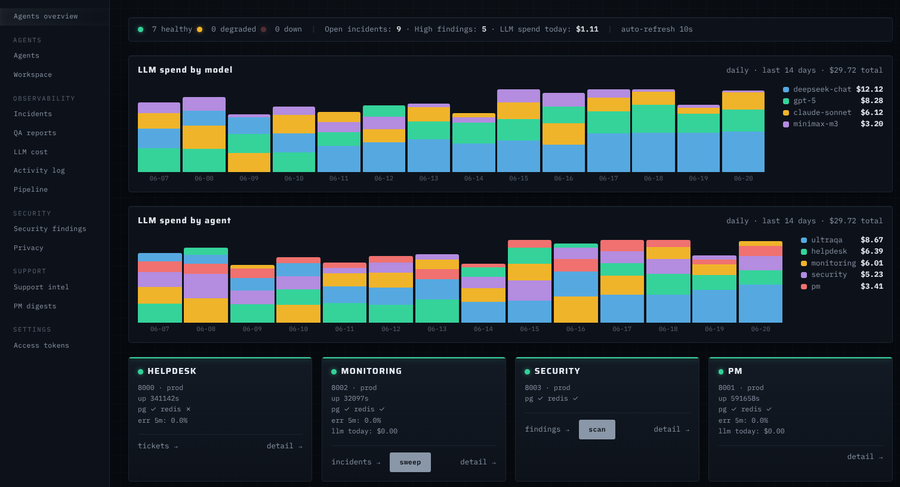

# agent-bakery

**Build & operate self-hosted LangGraph agents — Apache-2.0, no license keys, no managed runtime, no vendor egress.**

[](.github/workflows/ci.yml)
[](LICENSE)
[](https://www.python.org/)
[](https://github.com/astral-sh/ruff)
[](http://mypy-lang.org/)



A monorepo for running OSS LangGraph agents in production on your own
infrastructure. A shared Python toolkit (`agentkit`), an agent meta-monitor, an
HTMX ops console, and a reference agent — all independently deployable, all
on the same seam.

## Why agent-bakery?

- **OSS, $0, no egress.** Your agents embed the OSS LangGraph library in each
  agent's own process. No `langgraph build|up|deploy`, no license key, no
  beacon call to `beacon.langchain.com`. The infra you already run (Postgres,
  Redis, RabbitMQ, Ollama, your own OpenAI-compatible gateway) is the platform.
  See [`docs/adr/decisions.md`](docs/adr/decisions.md).
- **Multi-tenant by construction.** Every store call is scoped by `tenant_id`
  from the verified JWT (BR-002). The only cross-tenant principal is `ops`
  (US-013).
- **Per-request USD cost ceiling on the LLM.** The cost meter and ceiling
  live in `agentkit.llm.LLMClient` (BR-006), not as an after-the-fact
  analytics check.

## Quickstart

Requires [uv](https://docs.astral.sh/uv/) and Python 3.12+.

```bash
git clone https://github.com/sh00r3k/agent-bakery
cd agent-bakery

# 1. install the whole workspace editable
uv sync

# 2. run the tests
uv run pytest packages/agentkit/tests
uv run pytest agents/monitoring/tests
uv run pytest apps/dashboard/tests

# 3. run the example agent
cd examples/hello-agent
uv run --project ../.. uvicorn hello_agent:app --reload
# POST localhost:8000/echo  {"text":"world"} -> {"reply":"hello, world!"}
```

> Hello-agent uses the shared rate-limit middleware; without Redis the request
> still succeeds (with a `server.ratelimit_redis_unavailable` warning) but takes
> a few seconds to reply. To get instant responses, run `docker compose up -d
redis` from the repo root first.

For the full stack (Postgres + pgvector, Redis, RabbitMQ, dashboard), see
[`docs/deploy-your-own.md`](docs/deploy-your-own.md).

## What's in the box

| Member                      | What                                                                                                                                                           | When you need it                                               | Quick start                                          |
| --------------------------- | -------------------------------------------------------------------------------------------------------------------------------------------------------------- | -------------------------------------------------------------- | ---------------------------------------------------- |
| `packages/agentkit`         | Shared toolkit: config, LLM client with cost ceiling, observability, FastAPI server factory, JWT auth, Postgres/Redis pool, RabbitMQ alerts, heartbeat/metrics | You are building a new agent                                   | `from agentkit import BaseAgentSettings, create_app` |
| `agents/monitoring`         | Agent meta-monitor: scheduled probes → SLO rules → Signals → dedup into Incidents → RabbitMQ `agent.alerts`                                                    | You have more than one agent and need to know when one is down | `uv run python -m monitoring_agent`                  |
| `apps/dashboard`            | HTMX ops console: config-driven agent registry, HTTP fan-out, agent health, open incidents, cross-tenant reply/close                                           | You want a single page that sees all your agents               | `uv run python -m dashboard`                         |
| `examples/hello-agent`      | ~40-line reference agent showing the `agentkit` pattern                                                                                                        | You are new to the project                                     | `uv run uvicorn hello_agent:app --reload`            |
| `examples/classifier-agent` | ~80-line reference agent showing the prompt-safe LLM I/O pattern: fenced input, `complete_json` schema validation, deterministic fallback                      | You are building an agent that calls an LLM                    | `uv run uvicorn classifier_agent.api:app --reload`   |
| `apps/platform-cli`         | Operator CLI (`platform up/down`, agent add/remove, token mint, doctor) over docker-compose + the agent registry                                               | You operate the stack from the terminal                        | `uv run platform --help`                             |

## Architecture

```
                         ┌─────────────────────────────────────────┐
                         │              agentkit                    │
                         │  config · llm · server · auth · db ·     │
                         │  observability · notify · heartbeat      │
                         └───────────────┬─────────────────────────┘
              imports the toolkit ───────┼───────────────────────────
        ┌────────────────────┬─────────────────────┐
        ▼                    ▼                     ▼
  agents/monitoring    apps/dashboard     examples/hello-agent
  agent/meta monitor   HTMX ops console   ~40-line pattern
  scheduled probes     HTTP fan-out
        │                    │                     │
        └─────────┬──────────┴──────────┬──────────┘
                  ▼                      ▼
        Postgres (pgvector)   Redis · RabbitMQ · OpenAI-compatible LLM gateway
                  └──────── shared infra: docker network `agent_backend` ────────┘
```

See [`docs/architecture.md`](docs/architecture.md) for the full layer model,
the data flows (monitoring, dashboard fan-out, ultraQA sweep),
and the isolation guarantees.

## When NOT to use this

This project is opinionated. Pick a different tool if any of these are true
for you:

- **You want LangGraph Studio and visual debugging out of the box.** Use
  [LangGraph Platform](https://langchain.com) and accept the enterprise
  license and the egress to `beacon.langchain.com`.
- **You want a single-purpose RAG product, not a set of agents.** Use LlamaIndex, or
  a managed service (Vellum, Fixpoint, etc.).
- **You want a TypeScript-first framework.** Use [Mastra](https://mastra.ai)
  or [VoltAgent](https://voltagent.dev).
- **You want a hosted control plane for many agents.** Use a managed/hosted
  control plane, or wait for a hosted version of agent-bakery to exist (it does
  not).
- **You want a no-code visual builder.** Use Dify, Flowise, or Langflow.

This is the **honest** section. agent-bakery is an agent runtime, not a
product. It is the right choice for a small platform team that already
self-hosts Postgres and wants the same look-and-feel across every agent.

## Comparison

|                          | agent-bakery                            | LangGraph Platform (LangSmith Deployment) | Aegra                                         |
| ------------------------ | --------------------------------------- | ----------------------------------------- | --------------------------------------------- |
| License                  | Apache-2.0                              | Commercial (Enterprise)                   | Apache-2.0                                    |
| Self-hosting             | Yes — your infra                        | Enterprise license required               | Yes — your infra                              |
| License key              | No                                      | Yes (LangSmith key)                       | No                                            |
| Beacon egress            | No                                      | Required (`beacon.langchain.com`)         | No                                            |
| Primary use case         | Multi-agent workspace with shared infra | One agent at a time, managed              | Drop-in replacement for LangSmith Deployments |
| Multi-tenant isolation   | Yes (BR-002)                            | Bring your own                            | Bring your own                                |
| Cost ceiling per request | Yes (BR-006)                            | Bring your own                            | Bring your own                                |
| Agent observability      | Built-in (`agents/monitoring`)          | LangSmith only                            | Bring your own                                |
| HTML dashboard           | Yes (`apps/dashboard`, HTMX)            | LangSmith Studio                          | None (use LangGraph Studio)                   |
| Spec-Driven Development  | Yes (`docs/`)                           | No                                        | No                                            |

## Spec & docs

This project is Spec-Driven Development. The spec lives in [`docs/`](docs/);
the code follows.

- [`docs/README.md`](docs/README.md) — the docs map (start here)
- [`docs/vision.md`](docs/vision.md) — why the whole project exists
- [`docs/user-stories.md`](docs/user-stories.md) — behavior (US-NNN)
- [`docs/business-rules.md`](docs/business-rules.md) — cross-cutting rules (BR-NNN)
- [`docs/architecture.md`](docs/architecture.md) — how it is built
- [`docs/deploy-your-own.md`](docs/deploy-your-own.md) — bring up the full stack
- [`docs/add-your-own-agent.md`](docs/add-your-own-agent.md) — add another agent

## Roadmap

- ✅ **v0.2 — Private Mode.** `PRIVATE_MODE=true` blocks all outbound except
  the LLM gateway (verified by `packages/agentkit/tests/test_egress.py`).
  Dashboard UI pages (node health, workspace, activity stream + audit export,
  personal access tokens, privacy panel) shipped.
- **v0.3** — bring-your-own-gateway templates for LiteLLM and vLLM,
  `ops` audit-trail hardening for cross-tenant reads (BR-002).
- **v0.4** — `agents/monitoring` rule pack (community-contributed SLO
  rules in `agents/monitoring/rules/`).
- **v1.0** — first 1.0 release; pin the public API of `agentkit`; cut the
  `agentkit` 1.0 tag.

Out of scope (per [`docs/adr/decisions.md`](docs/adr/decisions.md)):
LangGraph Server/Platform/Studio adoption, license keys, `RemoteGraph`,
platform-run end-user identity.

## Community

- **Maintainer** — [@sh00r3k](https://github.com/sh00r3k) (security reports to sh00r3k@gmail.com)
- **Issues & feature requests** — GitHub Issues
  ([bug template](.github/ISSUE_TEMPLATE/bug_report.md),
  [feature template](.github/ISSUE_TEMPLATE/feature_request.md))
- **Questions & design discussion** — GitHub Discussions
- **Contributing** — see [CONTRIBUTING.md](CONTRIBUTING.md)
- **Security** — see [SECURITY.md](SECURITY.md)
- **Code of conduct** — see [CODE_OF_CONDUCT.md](CODE_OF_CONDUCT.md)
- **Governance** — BDFL model, decisions in [`docs/adr/`](docs/adr/),
  append-only

## License

[Apache-2.0](LICENSE).

## Acknowledgements

Built on: [LangGraph](https://github.com/langchain-ai/langgraph) ·
[FastAPI](https://github.com/tiangolo/fastapi) ·
[Postgres](https://www.postgresql.org/) + [pgvector](https://github.com/pgvector/pgvector) ·
[Redis](https://redis.io/) ·
[RabbitMQ](https://www.rabbitmq.com/) ·
[Ollama](https://ollama.com/) ·
[structlog](https://www.structlog.org/) ·
[Pydantic](https://docs.pydantic.dev/).
